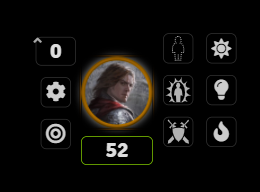

# TorchLight - A FoundryVTT Module

This is a slightly enhanced Torch and Light Module for Foundry VTT, based on the excellent work of RealDeuce on the Torch Module.

Instead of managing one light source, the Torchlight module recognises three different types of light sources, torches, lanterns and light spells, each with its own characteristics.

From the original module, I have dropped the management of Dancing Lights, as this should really just be its own module.

I must also confess that I am a complete noob at Foundry VTT, Javascript, JQuery and GitHub, so developing this was really a good way for me to learn things and discover Foundry VTT, so every bit of advice that can be provided would really be appreciated.

## Installation
### Method 1 (Not yet available)
- Start up Foundry and click "Install Module" in the "Add-On Modules" tab.
- Search for "Torchlight" in the pop up window.
- Click "Install" and it should appear in your modules list.

### Method 2
- Start up Foundry and click "Install Module" in the "Add-On Modules" tab.
- Paste the link: `https://raw.githubusercontent.com/PhilippeKr/TorchLight/main/module.json`
- Click "Install" and it should appear in your modules list.

### Method 3
- Download the [.zip file](https://github.com/PhilippeKr/TorchLight/raw/main/torchlight.zip) in this repository.
- Extract the contents of the zip in `\resources\app\public\modules\`
- Restart Foundry.

### Examples

##### HUD with TorchLight Icons

##### Light Spell Activated

All the lights are animated and look much better "live".

## Implemented Features
Torchlight provides 3 potential sources of light:
- Light Spell of varying aspects, with White Light (possibly for good characters), Red Light (probably not so good) and Green Light (for nature lovers out there, druids and rangers, I'm pointing at you)...
- Lantern, with hooded lanterns in both open and closed position, and bullseye lantern with enhanced range but only in a cone.
- Torch, with various colours and intensity

These are toggled on and off from the HUD of tokens, form three icons that can be positioned either to the left or to the right of the standard HUD. The icons are in the order Light >> Lantern >> Torch (top to bottom or left to right), and there are title texts (now, thanks for the suggestion and the way to implement, paullessing). Only one type of light source can be active at a given time, if you change your light source, simply deactivate the current one and activate the new one.

The DM can keep the activation/deactivation to himself (in which case the HUD of the players will just show whether there is a light source active) or he can delegate the management of the light to his player through an option of the module.

In addition, the options allow the independent configuration of the light sources:
- Range for bright and dim light
- Type of light emitted

At this stage, the module also has the option to check whether a character had the resources to create a light, casting the light spell, or having a torch, or a lantern with oil in his inventory. This is optional because very often (at least in our groups) the character bearing the light is not necessarily the one owning it or being able to cast it.

The check can be enabled for players, and the DM can also choose to have it made for him as well.

And there is another check, whether the resource is actually consumed when the light is lit. Finally, the name of the items to check and potentially consume is another parameter, with the default being "Torch" for a torch and "Oil (flask)" for a lantern, as these are the standard names from 5e.

## Tips and Tricks

Note that although it's not obvious from the description, the module really allows you to add different types of lights to different players. For example, you can easily set-up a hooded lantern on a token and a bullseye one on another token.

It just depends on the type selected for a given source of light, as set-up in the Module Settings. The type of light can be changed there, of course, but it's also very easy to set using a macro:
* game.settings.set('torchlight', 'lightType','Type1') for a white light spell
* game.settings.set('torchlight', 'lightType','Type5') for ared light spell
* game.settings.set('torchlight', 'lanternType','Type1') for an intense hooded lantern
* game.settings.set('torchlight', 'lanternType','Type7') for an intense bullseye lantern
* game.settings.set('torchlight', 'torchType','Type8') for an medium purplish torch
* etc.

## Planned Features
- None left, waiting for suggestions... :)

## Known Issues
* The position of the icons needs to be adjusted according to the size of the token.

## Release Notes

##### 0.8.3 - Very Minor Update
* Change the Light Spell Pulsating to real Pulse and add the swirly thing
* Added title text to the buttons and explanations above

##### 0.8.2 - Neutral Lights Update
* Added "Type 0" lights for all types of lights without effects

##### 0.8.1 - json Bug Fix uUdate
* Fixed the problem in the json that prevented it from loading

##### 0.8.0 - Consumption Update
* Added the potential consumption of a resource (torch or oil flask) when a light is lit
* Added the configuration of the name of the resource to consume
* Cleaned up the code from the original inspiration

##### 0.7.2 - Bug Fixes
* Corrected the problem occuring with systems other than 5e because of the check of a parameter defined only for 5e
* Corrected the menus for Top and Bottom

##### 0.7.1 - Top/Bottom Update
* Added the capability to display the icons at the top or bottom of the HUD

##### 0.7.0 - Availability Check Update
* Added the check of availability for a player to create a light
* Added the capability for the DM to have the check done for the actor/token selected

##### 0.6.5 - Yet Another Small Update
* Corrected the "Required field LightAlpha not present in token" error.

##### 0.6.4 - Another Small Update
* Corrected the colour of the effects not showing up
* Added the reference numbers to the types of lights, so that they can easily be referenced in macros
* Added the macros to quickly change the type in the readme.

##### 0.6.3 - Small Initial Update
* Corrected the problem generated by restoring the previous light of the token (storing the radius in pixels instead of grid units)
* Added images in the ReadMe.

##### 0.6.2 - Quick patch to correct the default values on the types of lights, causing problem on initial install.

##### 0.6.1 - Initial Release for testing to Discord and Reddit

## Acknowledgements
- Big thanks to Atropos for making a wonderful VTT that's worth making modules for!
- Many thanks to RealDeuce as well for making the original Torch module and giving me all these ideas!
- RedReign for providing the template for this Read me.
- Many thanks to the community on Dicord, so reactive and so helpful !

## License
The source code is licensed under "THE BEER-WARE LICENSE" (Revision 42).
