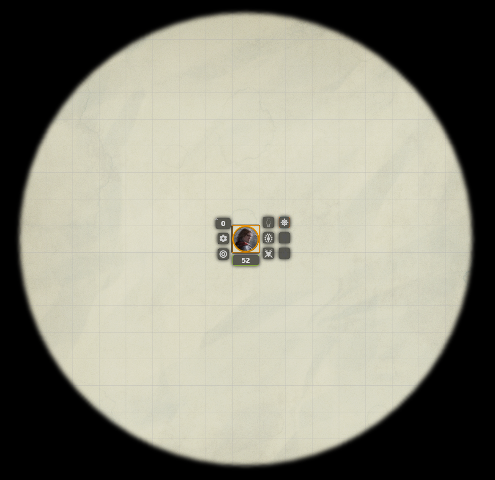

# LightsHUD - A FoundryVTT Module

Derived and updated version of Torchlight, which in turn was derived from Torch.

Dnd5e AND PF2e are now both supported for availability check and consumption.

## Known Issues
* The position of the icons needs to be adjusted according to the size of the token.
* When using french locale, there seems to be a conflict when using LightsHUD & Minimal UI with pf2 system.
* Flags on linked tokens are set on the actor rather than the token. (can cause weird behavior when running out of torches and changing scenes. Still working on it.)
## Installation
### Method 1
- Start up Foundry and click "Install Module" in the "Add-On Modules" tab.
- Search for "LightsHUD" in the pop up window.
- Click "Install" and it should appear in your modules list.

### Method 2
- Start up Foundry and click "Install Module" in the "Add-On Modules" tab.
- Paste the link: "https://github.com/Malekal4699/LightsHUD/releases/latest/download/module.json",
- Click "Install" and it should appear in your modules list.

### Method 3
	
- Download the [.zip file]("https://github.com/Malekal4699/LightsHUD/releases/latest/download/module.zip") in this repository.
- Extract the contents of the zip in `{USER_DATA_PATH}\data\modules\`
- Restart Foundry.

### Examples

##### HUD with TorchLight Icons

##### Light Spell Activated

All the lights are animated and look much better "live".

## Implemented Features
* removed current list. Will update soon.

## Tips and Tricks

Note that although it's not obvious from the description, the module really allows you to add different types of lights to different players. For example, you can easily set-up a hooded lantern on a token and a bullseye one on another token.

It just depends on the type selected for a given source of light, as set-up in the Module Settings. The type of light can be changed there, of course, but it's also very easy to set using a macro:
* game.settings.set('torchlight', 'lightType','Type1') for a white light spell
* game.settings.set('torchlight', 'lightType','Type5') for ared light spell
* game.settings.set('torchlight', 'lanternType','Type1') for an intense hooded lantern
* game.settings.set('torchlight', 'lanternType','Type7') for an intense bullseye lantern
* game.settings.set('torchlight', 'torchType','Type8') for an medium purplish torch
* etc.

## Planned Features
- TBD

## License
The source code is licensed under "THE BEER-WARE LICENSE" (Revision 42).
